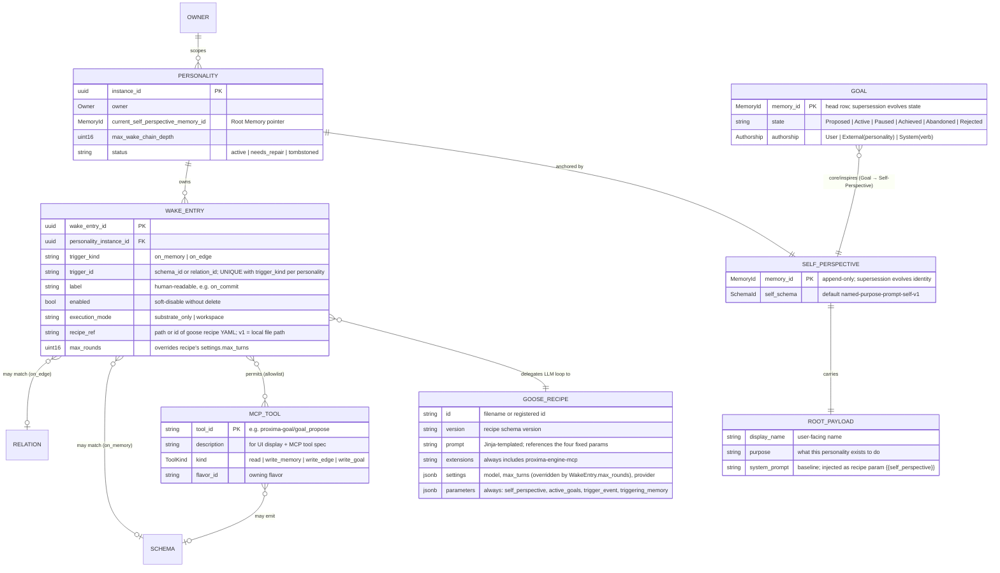

# Personality as Composed Behaviors

**Status:** Draft
**Date:** 2026-05-07
**Owner:** Heinrich
**Scope:** Substrate (`crates/core`, `crates/storage-pg`), every personality-shipping flavor (today: `flavors/code`, `flavors/goal`), wire (`proto/proxima/v1`, TS bindings), Personalities view (`packages/frontend-core/src/views/personalities`), Tauri shell, and the related numbered docs (`docs/02`, `docs/04`, `docs/06`, `docs/08`, `docs/13`, `docs/14`).
**Successor to:** [`2026-05-06-personality-wake-decide-write-design.md`](./2026-05-06-personality-wake-decide-write-design.md). Keeps that spec's wake/decide/write loop, idempotency story, ChangeEvent semantics, self-wake prohibition, and `wake_chain_depth` bound. Two changes from that spec: (1) personality is per-instance config composed from registered building blocks, not a Rust trait impl; (2) identity simplifies from `(type_id, instance_id)` to `instance_id` alone — no more type-level identifier on the row, since templates aren't a thing in v1 (per Q3).

## Goal

Eliminate the conceptual coupling between *what a personality is* (identity + behavior set) and *the Rust types that ship it*. **Stop building our own LLM harness.** After this spec lands:

- Flavors ship **building blocks** — typed schemas, tool implementations (as MCP tools), mechanical emitters, **bundled goose recipes**, and optionally a `register_owner_defaults(owner)` hook that auto-instantiates default personalities for new Owners.
- A **Personality** is a row in storage, not a Rust trait impl. It owns zero or more **WakeEntries** directly.
- A **WakeEntry** is one behavior row, keyed by triggering schema or relation. The trigger is stored as `(trigger_kind, trigger_id)` — *each trigger can be used at most once per personality*. This makes "what wakes this personality" a flat lookup, not a search.
- Each **WakeEntry** carries: trigger fields, filter modifiers (`authored_by`, `probability_promille`), a **recipe reference** (path to a goose recipe YAML), a **tool palette** (MCP tool allowlist enforced at our MCP server), and **max_rounds** (overrides the recipe's `settings.max_turns`). Per-entry prompt, per-entry model selection, and per-entry context customization live *inside the recipe*, not on the WakeEntry — recipe authors own those. The wake context the engine assembles is fixed: every wake gets four params (`self_perspective`, `active_goals`, `trigger_event`, `triggering_memory`), no per-entry configuration.
- A personality's **Self-Perspective** (Root Memory) carries `display_name`, `purpose`, and a `system_prompt` baseline. The dispatcher injects it into every wake as a recipe parameter; recipes that want it weave it into their prompt template via `{{ self_perspective }}`.
- **Goals are core entities with flavor-registered payload schemas.** Core owns the `Goal` entity, `GoalState` lifecycle, `GoalAuthorship`, the `GoalPayload` trait, the `GoalWrite` verb, the `core/inspires` relation, and the active-goal query semantics. The reference `proxima-goal` flavor ships concrete payload schemas (`proxima-goal/simple-text-v1`, `proxima-goal/task-v1`), the proposal/accept/decline MCP tools, and renderers — not the entity contract. A different deployment can register `proxima-code/refactor-goal-v1` or `proxima-product/launch-goal-v1` against the core trait without touching core. Two creation paths: manual (user attaches via UI, lands at `state = Active`) and self-authored (a wake calls `proxima-goal/goal_propose`, lands at `state = Proposed`, requires user approval before influencing future contexts). **Approval is a Goal supersession to `state = Active`; decline supersedes to `state = Rejected`** — there is no separate GoalConnection sidecar, the Goal's own lifecycle is the approval state. **Approval requires no synthetic wake event** — the next wake's `active_goals` param picks up the now-Active goal, and behavior changes from there.
- **The agent loop is goose, period.** Wake fires → engine invokes `goose run --recipe path --params ...` with a per-wake credential in env → goose connects to the engine's MCP listener using that credential → engine's MCP server enforces tool authorization against `WakeEntry.substrate_tool_palette` → goose runs its loop until done or `max_rounds` exhausted. We do not implement a tool-call loop. We do not implement model adapters. We do not implement turn streaming. **Goose owns the harness; the engine owns the substrate (storage, change events, dispatch, authorization).**

The user-visible payoff: a Personality can be authored from scratch in the UI from existing building blocks, without recompiling. The user can add one WakeEntry row for each triggering schema or relation, point it at a goose recipe (shipped or hand-rolled), pick which tools it can call. The user can audit "what wakes this personality, what does it see beforehand, what can it call" all in one table.

The architectural payoff: hardcoded `PersonalityFlavor` impls become migration sugar. The composability invariants from `2026-05-06-personality-wake-decide-write-design.md` (single dispatcher, single wake/decide/write loop, append-only memory, lineage by edge) survive intact. The harness work we'd otherwise own (Anthropic SDK adapter, tool-call retry, multi-turn state, streaming) we don't own — goose ships and maintains it. We win back months of substrate work to spend on the parts that are actually ours: ontology, memory, the spinning wheel, marketplaces.

## Non-Goals

- Tool implementations are not user-authored. Tools are flavor-shipped Rust impls exposed via the engine's MCP server. Composability is at the *selection* level (which tools a WakeEntry's palette permits), not the *implementation* level.
- Schemas are not user-authored. Sidecar tables are typed Rust payloads compiled in via `proxima_flavor!`. Composability is at the *reference* level (a WakeEntry palette references tool ids that emit registered schemas).
- We do not implement an LLM tool-call loop, model adapter, retry logic, streaming, or token accounting in v1. Those are goose's job. The engine's job is dispatch + storage + authorization.
- This spec simplifies identity from `(type_id, instance_id)` to `instance_id` alone. The previous spec's `personality_type_id` slot on memory rows, wake-config rows, and invocation rows is dropped — `personality_instance_id` was already unique and is sufficient for self-wake exclusion, idempotency, and authorship.
- **Personalities are LLM-backed by definition.** Every WakeEntry runs a goose recipe; every wake invokes a model. Cron-style mechanical workers, scheduled batch jobs, periodic non-LLM tasks — all out of scope for v1. The point of the substrate is giving a model a body (memory + identity + perception + action) and a body to give it. Mechanical scheduled side-effects, if they ever land, are a separate primitive not a Personality variant.
- This spec does not introduce a separate Decider wire protocol. The Decider becomes "the goose process plus our MCP server"; clients still see only the engine's typed surfaces.

## Entity Model



The diagram makes four structural commitments worth calling out:

1. **Personality owns WakeEntries directly.** There is no WakeConfig wrapper row; the WakeEntry table is the behavior matrix.
2. **Each WakeEntry has a unique trigger per Personality.** Two entries cannot both fire on `(on_memory, proxima-code/commit-summary-v1)`. This means trigger-to-behavior is a flat lookup: dispatcher matches a ChangeEvent's schema/relation against `(wake_entries.trigger_kind, wake_entries.trigger_id)`, gets at most one entry per personality, fires it (or not).
3. **The wake context is fixed, not user-configurable.** Every wake gets exactly four recipe parameters: `self_perspective`, `active_goals`, `trigger_event`, `triggering_memory`. No per-WakeEntry ContextBuilder, no flavor-extensible context-source kinds, no parameter-binding contract to validate. If a recipe needs deeper data, it asks via an MCP tool. v1 trades one round-trip per wake for a much smaller surface area.
4. **The recipe owns the prompt and the model.** Per-WakeEntry "what to think about, how to reason, which model to use" lives in the goose recipe YAML, not on the WakeEntry row. The WakeEntry references the recipe by id/path, picks which MCP tools the goose process is allowed to call, and overrides max_turns.

The Personality / Self-Perspective / Root Payload split (three boxes anchored by a pointer) is unchanged from the existing wake/decide/write spec — that indirection is what lets the user supersede the Root Payload without minting a new Personality.

## The Spinning Wheel — Detailed Flow

```mermaid
sequenceDiagram
    autonumber
    participant Reality
    participant Source as Mechanical Emitter
    participant Engine
    participant Stream as ChangeEvent stream
    participant Dispatcher
    participant Goose as goose subprocess
    participant MCP as Engine MCP server
    participant Storage

    Reality->>Source: file change / commit / user goal-write / goal approval
    Source->>Engine: append memory (e.g. commit-v1; or Goal supersession on accept/decline)
    Engine->>Storage: write memory (author = external | user)
    Engine->>Stream: emit ChangeEvent

    loop dispatcher tick (per Owner)
        Dispatcher->>Storage: SELECT wake_entries WHERE<br/>(trigger_kind, trigger_id) = event trigger<br/>JOIN personality (status=active)
        loop per matching WakeEntry
            Dispatcher->>Dispatcher: authored_by allows event.author?<br/>(self-wake excluded)
            Dispatcher->>Dispatcher: probability_promille roll
            alt fires
                Dispatcher->>Storage: idempotency check<br/>(instance, wake_entry_id, change_event_seq)
                alt not seen
                    Dispatcher->>Storage: chain depth check<br/>(event.wake_chain_depth < instance.max_wake_chain_depth)
                    alt within budget
                        Dispatcher->>Storage: assemble fixed wake context:<br/>self_perspective (Root Payload),<br/>active_goals (core/inspires edges to current Self-Perspective<br/>where Goal head state=Active),<br/>trigger_event (the ChangeEvent),<br/>triggering_memory (memory + sidecar payload)
                        Dispatcher->>Storage: insert invocation row<br/>(status=running, wake_token=uuid, recipe_sha256=...)
                        Dispatcher->>Goose: spawn `goose run --recipe RECIPE_REF<br/>--params self_perspective=... active_goals=...<br/>trigger_event=... triggering_memory=...<br/>--max-turns N`<br/>env: PROXIMA_WAKE_TOKEN=uuid,<br/>PROXIMA_MCP_URL=http://127.0.0.1:.../mcp

                        loop goose internal loop (≤ max_rounds turns)
                            Goose->>MCP: tool call with PROXIMA_WAKE_TOKEN
                            MCP->>MCP: resolve token → wake_entry<br/>authorize tool ∈ wake_entry.substrate_tool_palette
                            alt allowed write tool
                                MCP->>Engine: invoke (e.g. emit_perspective)
                                Engine->>Storage: append memory<br/>(author = personality_instance_id,<br/>wake_chain_depth = trigger.depth + 1)
                                Engine->>Stream: emit ChangeEvent
                                MCP-->>Goose: tool result
                            else allowed read tool
                                MCP->>Storage: query / fetch / search
                                Storage-->>MCP: results
                                MCP-->>Goose: tool result
                            else tool not in palette
                                MCP-->>Goose: error: tool_not_authorized
                            end
                        end

                        Goose-->>Dispatcher: exit (code + structured outcome)
                        Dispatcher->>Storage: revoke wake_token; finalize invocation<br/>(succeeded | truncated | failed)
                    end
                end
            end
        end
        Dispatcher->>Storage: advance personality_wake_cursor.last_considered_seq
    end
```

Three flow notes the diagram leaves implicit:

- **Goal approval is silent on the wake stream by default.** When the user approves a self-authored Goal, the substrate verb supersedes the Goal head row to `state = Active`. The append-only `core/inspires` edge stays unchanged — under the append-only model we don't mutate edges to reflect lifecycle, the Goal head is the sole approval state. The supersession does emit a ChangeEvent (memory append), but no personality has a WakeEntry on Goal-state transitions by default, so no wake fires. The next time *any* personality fires for *any* reason, the engine assembles its `active_goals` param fresh and picks up the now-Active goal. **If a flavor wants explicit reactive wakes on approval**, it can emit a `proxima-goal/goal-activated-v1` Fact from inside the approval verb; personalities that care add a WakeEntry with `(trigger_kind, trigger_id) = (on_memory, proxima-goal/goal-activated-v1)`. The substrate doesn't impose this.
- **WakeEntry trigger lookup is a flat indexed query, not a per-personality scan.** With the `(personality_instance_id, trigger_kind, trigger_id)` UNIQUE constraint and a btree on `(trigger_kind, trigger_id)`, the dispatcher's per-event work is `O(matching wake_entries)`, not `O(personalities × entries)`.
- **The wake token is short-lived and per-invocation.** Generated when the dispatcher inserts the `running` invocation row; revoked when the invocation finalizes. If goose crashes, the token expires (TTL = `max_rounds × per_round_max_seconds`). Dispatcher's GC reaper sweeps `running` rows past TTL and finalizes them as `failed`. No leaked credentials, no zombie processes calling MCP after the wake is over.

## Target Architecture (Crisp Definitions)

### Personality

A row in `proxima_core.personality` (current `personality_wake_config` is split into `personality` plus direct `personality_wake_entries` — see Storage Shape).

```
Personality {
  instance_id:                          Uuid               // stable across self-Perspective evolution; the only identity
  owner:                                Owner
  current_self_perspective_memory_id:   MemoryId           // Root Memory pointer
  max_wake_chain_depth:                 u16                // per-instance budget
  status:                               PersonalityStatus  // active | needs_repair | tombstoned (existing)
  created_at, updated_at, tombstoned_at
}
```

A Personality has zero or more WakeEntries. A Personality with zero enabled WakeEntries never wakes (and the Personalities view marks it "Inert"). A Personality with at least one enabled WakeEntry but all of its triggers orphaned (no producer) is marked "Stranded" — see the wake-graph-emitters-reachability-tools plan.

### Self-Perspective (Root Memory)

A typed Memory of kind Perspective whose payload is the Personality's identity:

```
Default schema: proxima-core/named-purpose-prompt-self-v1
{
  display_name:    String
  purpose:         String
  system_prompt:   String
}
```

Specialized self-schemas remain available — a flavor that needs structured Self state (e.g. a Worker tracking its current task ID) ships its own Self schema and uses the same baseline three fields plus its own.

Editing any of the three fields supersedes the Self-Perspective Memory (append-only; ChangeEvent kind `EntityMutated`) and advances `Personality.current_self_perspective_memory_id`. Wake-time prompt assembly always reads the *current* Root Payload — there is no caching at the WakeEntry level.

### WakeEntry

```
WakeEntry {
  wake_entry_id:            Uuid
  personality_instance_id:  Uuid
  trigger_kind:             TriggerKind      // on_memory | on_edge
  trigger_id:               String           // schema_id or relation_id; UNIQUE with trigger_kind per personality
  label:                    String           // human-readable: "on_commit"
  enabled:                  bool
  execution_mode:           ExecutionMode    // substrate_only | workspace
  authored_by:              WakeAuthoredBy   // any | self_perspective | other
  probability_promille:     u16              // 0..=1000
  recipe_ref:               RecipeRef        // runner recipe id/path; v1 adapter = goose recipe YAML
  substrate_tool_palette:   Vec<String>      // Proxima MCP tool ids
  workspace_tool_palette:   Vec<String>      // provider-neutral workspace capabilities
  max_rounds:               u16              // overrides the recipe's settings.max_turns

  created_at, updated_at
}
```

**Trigger uniqueness is structural, not advisory.** A unique constraint on `(personality_instance_id, trigger_kind, trigger_id)` makes "two entries on `(on_memory, proxima-code/commit-summary-v1)`" rejected at the storage layer. Authoring UIs see the constraint via the storage error, not via a separate validation pass. Keeping `trigger_kind` separate from `trigger_id` avoids string-collision ambiguity between schema ids and relation ids.

The dispatcher's idempotency key extends from `(instance_id, change_event_seq)` to `(instance_id, wake_entry_id, change_event_seq)` — but since at most one entry can match per personality per ChangeEvent (uniqueness above), this key never collides in practice.

A WakeEntry with an empty tool palette spawns goose in a read-only mode — no MCP tools authorized, no writes possible. The fixed wake-context params are still assembled and passed; the recipe still runs the LLM. Useful for periodic introspection without write authority.

**`recipe_ref` in v1 is a local file path.** Two paths supported:
1. **Bundled recipes** ship inside the flavor crate: `flavors/code/recipes/commit_summary.yaml`. The flavor's `register()` function records the absolute path at runtime; WakeEntries reference them as `recipe_ref = "bundled:proxima-code/commit_summary"` which resolves through the registry.
2. **User recipes** live under `~/.proxima/recipes/<owner>/<filename>.yaml`. The user manages files in their editor; the WakeEntry stores the filename as `recipe_ref = "user:filename"`. No DB persistence of the YAML body in v1.

DB-persisted recipes (with schema validation, marketplace sharing, version pinning) are explicitly v1.1+. The user-facing payoff in v1 is "edit a YAML file, restart the wake, see the change" — no UI editor required for recipe authoring.

### Wake Context (fixed)

The engine assembles four parameters before every wake. Same four every time, every WakeEntry, every Personality. No per-entry configuration, no flavor extensibility, no DSL. The dispatcher reads them from storage, JSON-serializes each, and passes them as recipe parameters via `goose run --params`.

| Param | What it carries |
|---|---|
| `self_perspective` | The Personality's current Root Payload — `{ display_name, purpose, system_prompt }`. Read fresh from `current_self_perspective_memory_id` per wake, so identity edits land on the next wake. |
| `active_goals` | All Goals connected via `core/inspires` to the personality's current Self-Perspective whose head row has `state = Active`. JSON array of `{ goal_payload, motivation_via }` objects. Goals in `Proposed` (awaiting user approval), `Paused`, `Achieved`, `Abandoned`, or `Rejected` states are excluded by construction. |
| `trigger_event` | The ChangeEvent envelope (kind, sequence number, schema_id, owner, author, wake_chain_depth). |
| `triggering_memory` | The memory row the ChangeEvent points at, with its typed sidecar payload resolved. For an `on_memory` filter this is always present; for `on_edge` filters this is the edge's source or target memory (whichever the filter is anchored on). |

**That's the entire deterministic context.** If a recipe needs more — specific commit fields, a code-graph neighborhood, related memories, prior perspectives — the LLM uses MCP tools to fetch them. The recipe author's job is to write a prompt that knows how to use the four fixed params and which MCP tools to reach for; the substrate's job is to assemble them.

**Why fixed, not configurable:**
- No per-entry editor — the WakeEntry form has no ContextBuilder sub-form, only the recipe picker + tool palette.
- No flavor-extensibility shim — flavors don't register `ContextSourceKind`s; they register MCP tools (which they already do).
- No `param_name` binding contract — every recipe knows the four fixed names; no "your ContextSource doesn't bind the param the recipe needs" validator.
- No JSONPath DSL — there's nothing to author.

**The cost we're accepting:** if an LLM needs commit details on every wake, it round-trips through `core/fetch_memory` (or a flavor-shipped equivalent) instead of seeing the fields injected. That's one tool turn per wake, included in `max_rounds`. For v1 wake rates this is irrelevant; for performance-critical workflows post-v1, a future spec can add typed context injection where it actually pays off.

**Recipes can ignore params.** Goose's behavior is: extra params not declared in the recipe's `parameters` block are dropped silently. So a recipe that only references `{{ self_perspective }}` and `{{ trigger_event }}` works fine — it just never sees `active_goals` or `triggering_memory`. No engine error.

### MCP Tool

Tools are MCP tools — exposed by the engine's MCP listener (`crates/mcp-server`), declared by flavors at build time via `add_mcp_tool!`:

```rust
pub trait McpTool: Send + Sync {
    const NAME: &'static str;              // e.g. "proxima-goal/goal_propose"
    const DESCRIPTION: &'static str;       // shown in MCP tool spec
    type Args: JsonSchema + DeserializeOwned;
    type Result: JsonSchema + Serialize;
    async fn invoke(ctx: &McpContext, args: Self::Args) -> Result<Self::Result, McpToolError>;
}
```

The pool is the same one external MCP clients see today. The novelty is that goose, when spawned by the dispatcher with `PROXIMA_WAKE_TOKEN` in env, becomes one more MCP client — but a constrained one: the token resolves to a WakeEntry whose `substrate_tool_palette` is the allowlist. A goose process trying to call a Proxima MCP tool not in the allowlist hits an `Unauthorized` error from our MCP server, the same way an external MCP client without the right Owner scope would.

**Tool discovery is token-scoped.** The MCP server does not expose the full substrate tool catalog to a wake-token client:

| MCP request | Wake-token behavior |
|---|---|
| `tools/list` | Return only tools in the WakeEntry's `substrate_tool_palette`. |
| `tools/call(name, args)` | Resolve token → WakeEntry; reject unless `name` maps to a tool in `substrate_tool_palette`. |

This is the primary scoping mechanism. Goose `available_tools` is still generated, but only as a client-side narrowing layer so the model sees the intended tool subset. The hard boundary is the MCP server's token-scoped discovery and call authorization.

Tool ids have two names:

| Name | Example | Use |
|---|---|---|
| Canonical Proxima tool id | `proxima-goal/goal_propose` | Stored in `WakeEntry.substrate_tool_palette`, registry, audit logs, docs. |
| Goose-visible MCP tool name | `proxima_goal__goal_propose` | Returned by MCP `tools/list`, referenced by goose `available_tools`, used in `tools/call`. |

The registry owns the bijection. WakeEntry write-time validation checks that every canonical `substrate_tool_palette` item resolves to a registered MCP tool and a Goose-visible name. Dispatch-time recipe generation fills `available_tools` from that resolved name set. The MCP call path maps Goose-visible names back to canonical ids before authorization and invocation.

Substrate ships read tools (`core/fetch_memory`, `core/query`, `core/search_by_embedding`) and the bare emit tools (`core/emit_abstraction`, `core/emit_perspective`); flavors ship specialized writers (`proxima-goal/goal_propose`, future `proxima-code/...`).

`writeable_schemas` and `writeable_relations` (today's per-personality declarations) **derive** from the union of substrate tool palettes across the personality's WakeEntries: `union over wake_entries of union over substrate_tool_palette of tool.emittable_schemas`. There is no separate declaration to drift.

### Goose Recipe Integration

The substrate spawns `goose run` per wake. Recipes are goose's standard YAML format ([reference](https://goose-docs.ai/docs/guides/recipes/recipe-reference)). Two conventions the engine relies on:

**1. The engine controls the effective extension list.** Recipes that a Proxima flavor ships declare the work prompt and model settings; the dispatcher resolves the WakeEntry and writes the effective runner configuration at spawn time. `substrate_only` wakes get only Proxima's own MCP extension. `workspace` wakes additionally get provider-neutral workspace capabilities through the selected runner adapter. Recipe-authored extension declarations are treated as capability requests and must be accepted by the WakeEntry execution mode; they are not the security boundary.

```yaml
# Recipe authors write:
version: "1.0.0"
title: "Commit Summary"
parameters:
  - key: trigger_event
    input_type: string
    requirement: required
  - key: triggering_memory
    input_type: string
    requirement: required
  - key: self_perspective
    input_type: string
    requirement: required
prompt: |
  You are {{ self_perspective.display_name }}, whose purpose is "{{ self_perspective.purpose }}".
  System guidance: {{ self_perspective.system_prompt }}

  A new commit has landed:
  {{ triggering_memory }}

  Call `core/emit_abstraction` exactly once with schema_id = "proxima-code/commit-summary-v1"
  and a payload matching the schema. Do not call any other tool.
settings:
  goose_provider: "ollama"
  goose_model: "llama3.1:8b"
  max_turns: 4

# Engine injects (or overrides) at spawn time:
extensions:
  - type: streamable_http
    name: proxima-engine-mcp
    url: ${PROXIMA_MCP_URL}
    available_tools:
      - core__emit_abstraction
    headers:
      authorization: "Bearer ${PROXIMA_WAKE_TOKEN}"
    timeout: 300
```

**2. `WakeEntry.max_rounds` is the only WakeEntry-level override on the recipe.** It overrides `settings.max_turns` via `--max-turns` on the goose CLI. Everything else the recipe defines — prompt, model, provider, temperature, retry behavior, sub-recipes — is owned by the recipe author and not exposed as a per-WakeEntry knob. This keeps the WakeEntry shape minimal (execution mode / recipe_ref / palettes / max_rounds) and pushes per-personality customization into recipes (where the user can fork a bundled recipe into `~/.proxima/recipes/<owner>/` and edit anything they want).

**Spawn invocation:**

```
goose run \
  --recipe /path/to/recipe.yaml \
  --params trigger_event='{"...JSON..."}' \
  --params triggering_memory='{"...JSON..."}' \
  --params self_perspective='{"...JSON..."}' \
  --params active_goals='[{"...goal1..."}, ...]' \
  --max-turns ${WAKE_ENTRY_MAX_ROUNDS} \
  --no-interactive
```

**Env injected by Proxima — two always, plus provider credentials when registered:**

| Always | What it does |
|---|---|
| `PROXIMA_WAKE_TOKEN` | Per-invocation MCP credential (resolves to `(personality_instance_id, wake_entry_id)` on every tool call; revoked on finalize). |
| `PROXIMA_MCP_URL` | Where to find the engine's MCP server (e.g. `http://127.0.0.1:31415/mcp`). |

| Conditional | When |
|---|---|
| `OPENAI_API_KEY`, `ANTHROPIC_API_KEY`, `OLLAMA_HOST`, etc. | When the recipe's `settings.goose_provider` matches a credential registered in Proxima's per-Owner model registry. The dispatcher resolves the registered key for the recipe's selected provider/model and injects it. |

**Two-tier credential resolution.** Proxima holds an optional per-Owner model registry (BYOK). At spawn time:

1. Dispatcher reads the recipe's `settings.goose_provider` / `goose_model`.
2. If Proxima's model registry has a matching credential for this Owner, inject the appropriate env var (`OPENAI_API_KEY`, etc.) into the goose subprocess env. **This is the recommended UX**: register a key once in Proxima Settings → Models, both embeddings (in-process, see below) and goose-driven personality wakes use it.
3. If not registered, the env var is not injected; goose falls back to its own config (`~/.config/goose/config.yaml`) or the parent process env. Standalone `goose configure` keeps working as a perfectly valid setup path for users who prefer to manage providers outside Proxima.

**The same registered credentials power non-personality model calls.** The `crates/llm-openai-compat` client is still load-bearing for embeddings (run during ingest, not personality-driven) and any future flavor-shipped automatic-but-non-personality model calls (deterministic schema-typed extractors, periodic similarity recomputes). Those callers read from the same per-Owner registry as goose's spawn env. One credential, two consumers.

**Per-Owner credential isolation matters for multi-user/hosted deployments.** v1 desktop is single-user so Owner-isolation is mostly cosmetic — but the storage shape is correct from day one (the registry is keyed `(owner, provider)`), so the multi-user transition doesn't require a credential-storage refactor.

**Acknowledged trade-offs of the goose-only choice:**

- **No per-turn telemetry inside goose.** We see invocation start, every MCP tool call (which is most of what matters), invocation end, and goose's structured outcome. We do not see internal model-retry attempts or token counts per turn. Workable; we record per-MCP-call cost (model-side estimates) and the dispatcher correlates by `wake_token`.
- **In-process LLM client kept, but only for non-personality work.** `crates/llm-openai-compat` survives v1 because embeddings (run during ingest) and other deterministic, non-personality flavor work still need it. Personality wakes do not — they go through goose. The crate's tool-call/multi-turn helpers can be dropped since goose owns those.
- **Per-Owner credential storage is load-bearing.** The model registry is the single source of truth for provider credentials, used both by in-process embeddings and (via spawn-env injection) by goose. Users register once; both consumers benefit. Standalone `goose configure` remains a fallback for users who prefer to keep credentials outside Proxima.
- **Subprocess overhead.** ~50–100ms of goose process startup per wake. For our wake rates (handfuls per minute, peaking on ingest bursts) this is invisible. If a future workload needs millions of wakes per hour, we revisit then.
- **Tied to goose's release cadence.** Per Q10: v1 accepts whatever's on PATH. If goose makes a breaking recipe-schema change, the engine's `goose recipe validate` boundary catches it before a wake fires.

**Why not also keep a Native backend?** Considered; rejected as scope creep for v1. Maintaining two backends doubles testing, doubles the wake-context rendering paths, and doubles the cancellation story. If we ever hit a load profile or behavior that goose can't serve, we add a second backend then. For v1: one path, one bug surface.

### Execution Modes

WakeEntries declare one of two execution modes. The mode controls which non-Proxima capabilities can appear in the effective runner config. The DB stores Proxima capability policy, not Goose-specific tool names.

| Mode | Effective capabilities | Boundary |
|---|---|---|
| `substrate_only` | Proxima MCP extension only, filtered by `WakeEntry.substrate_tool_palette` via runner-specific tool filtering; every call still authorized by `PROXIMA_WAKE_TOKEN`. | Default. No workspace filesystem mutation except whatever the Proxima MCP tools themselves do. |
| `workspace` | Proxima MCP extension plus explicitly allowed workspace capabilities (`file_read`, `file_write`, `shell_run`, `git_commit`, `staging_push`, external forge helpers). | Requires isolated worktree and explicit user acceptance before target-branch merge. |

For the Goose runner, `available_tools` is a context and performance filter, not an authorization boundary. Goose supports per-extension `available_tools`; the dispatcher always fills it from `WakeEntry.substrate_tool_palette` for `proxima-engine-mcp`. Proxima still rejects any MCP call whose token does not authorize the requested tool. This gives two layers:

1. Goose sees only the intended tools in its prompt/tool registry.
2. Proxima enforces the real allowlist on every call.

`workspace_tool_palette` is provider-neutral. The Goose adapter maps it to Goose extension/tool names:

| Proxima workspace capability | Goose adapter example |
|---|---|
| `file_read` | Developer file/text-editor read capability. |
| `file_write` | Developer text-editor write capability. |
| `shell_run` | Developer shell capability. |
| `git_commit` | Developer shell/git capability constrained to the worktree. |
| `staging_push` | Developer shell/git or forge extension constrained to `proxima/wake/<invocation_id>`. |

Code Mode is a Goose adapter optimization for `workspace` mode, not a Proxima schema concept. If a WakeEntry exposes many workspace capabilities, the Goose adapter may enable Code Mode so the model sees a small meta-tool surface and discovers concrete runner tools on demand. The DB still stores only `workspace_tool_palette`.

Workspace mode is how the loop closes for personalities that must do real work, not only write memories. The clean v1 execution path:

1. Create an isolated git worktree from the configured target branch.
2. Spawn a container or other sandbox with that worktree mounted as the session root.
3. Run `goose run` inside the sandbox with:
   - generated effective recipe,
   - `PROXIMA_WAKE_TOKEN`,
   - `PROXIMA_MCP_URL`,
   - registered provider credentials,
   - host tools filtered to the WakeEntry's host-tool allowlist,
   - cwd set to the worktree root so MCP Roots-aware extensions see the allowed workspace.
4. Let goose edit, test, and commit inside the worktree. Partial writes stay in the worktree; Proxima memory writes stay append-only.
5. On success, create an integration artifact: branch, commit SHA, diff summary, test output, invocation id, and recipe SHA.
6. Optional: push the worktree branch to a remote staging namespace (`proxima/wake/<invocation_id>`).
7. User or policy accepts/rejects. Accept merges or opens a PR into the target branch; reject tombstones/closes the integration artifact and leaves the branch/worktree for audit or cleanup.

No v1 path auto-merges into a protected target branch. Auto-commit is allowed inside the isolated worktree; auto-push is allowed only to a staging branch; target-branch merge is an explicit accept step. This keeps the agent able to close the implementation loop while preserving the user's final control over Reality.

Workspace mode deliberately does **not** rely on `.gooseignore` as the hard boundary. `.gooseignore` is useful defense-in-depth for Goose's Developer extension, but the hard boundary is the disposable worktree/container plus explicit capability allowlists. MCP Roots help extensions discover the active workspace; they do not replace filesystem isolation.

### How Personalities Come Into Existence

Three paths, each load-bearing for a different audience:

**1. Phase 1 migration writes the existing hardcoded personalities as rows.** The current `CommitSummaryPersonality` and `CodeEngineerPersonality` Rust impls are read at migration time; their `system_prompt()`, `default_wake_filters()`, and `tools()` are extracted into bundled goose recipes (`flavors/code/recipes/commit_summary.yaml`, `flavors/code/recipes/code_review.yaml`) plus rows in `personality` + `personality_wake_entries`. After the migration runs once per existing DB, this path is retired.

**2. Flavor-shipped owner defaults: `register_owner_defaults(owner)`.** Replaces today's `provision_owner` defaulting mechanism. Each flavor crate optionally registers a Rust function that the engine calls when a new Owner is provisioned. The function returns a list of personality + wake-entry writes the engine performs in one transaction. This is the path for "new user installs Proxima with the Code flavor and gets a working Engineer out of the box." It is **just code**, not a registered "Template" entity in storage. After it runs, the resulting personality is fully owned by the user — there is no template to reference back to or diff against.

```rust
// flavors/code/src/lib.rs
pub fn register_owner_defaults(owner: &Owner) -> Vec<PersonalityProvisionWrite> {
    vec![
        PersonalityProvisionWrite {
            self_payload: NamedPurposePromptSelf {
                display_name: "Engineer".into(),
                purpose: "Develop perspectives on code changes".into(),
                system_prompt: include_str!("../prompts/engineer_baseline.md").into(),
            },
            wake_entries: vec![
                WakeEntryProvisionWrite {
                    trigger_kind: TriggerKind::OnMemory,
                    trigger_id: "proxima-code/commit-summary-v1".into(),
                    label: "on_commit_summary".into(),
                    recipe_ref: "bundled:proxima-code/code_review".into(),
                    execution_mode: ExecutionMode::SubstrateOnly,
                    substrate_tool_palette: vec!["core/emit_perspective".into()],
                    workspace_tool_palette: vec![],
                    max_rounds: 4,
                    probability_promille: 1000,
                    authored_by: WakeAuthoredBy::Any,
                },
                // ... more entries if the default Engineer should react to more triggers
            ],
        },
    ]
}
```

(No `context_builder` field on `WakeEntryProvisionWrite` — the four fixed params get assembled at fire time, regardless of who wrote the WakeEntry.)

**3. User composes from scratch via the Personalities view.** This is the only path for personalities that don't come from a flavor's defaults. The form (stress test 10) walks the user through Self-Perspective fields → WakeEntry rows → recipe picker → tool palette. On submit, the substrate verb writes the rows. After creation, the personality is indistinguishable from one written by `register_owner_defaults` — there is no "origin" stamp, no template diff, no provenance metadata beyond `created_at`.

**Why no Template entity:** the entity adds storage, a registry, an editor UI, and a "diff against template" concept that quietly become more code than they remove friction. v1 sidesteps the question entirely. If a future spec wants a marketplace of shareable personality definitions, that is a v1.1+ feature that can land alongside DB-persisted recipes — at which point a "Template" entity might earn its keep. v1 stays small.

User-authored recipes go in `~/.proxima/recipes/<owner>/<filename>.yaml` and are referenced as `recipe_ref = "user:my-custom-recipe"` (resolves to `~/.proxima/recipes/<owner>/my-custom-recipe.yaml`). The Personalities view's WakeEntry editor exposes a native file picker rooted at that directory; selecting a file outside the directory copies it in (so we never store absolute paths that move when the user reorganizes their filesystem). Every selection runs `goose recipe validate` server-side before the editor enables save.

### Goals and `core/inspires`

**Goal is a core entity; payloads/tools live in flavors.** The split:

| Layer | Owns |
|---|---|
| **Core** (`crates/core`) | `Goal` entity kind, `GoalState` lifecycle, `GoalAuthorship`, the `GoalPayload` trait (registration surface for typed payloads), the `GoalWrite` protocol verb, the `core/inspires` relation, the active-goal query semantics, owner scoping, supersession rules, `Query`/`Subscribe` support. |
| **Reference goal flavor** (`flavors/goal`) | Concrete `GoalPayload` impls (`proxima-goal/simple-text-v1`, `proxima-goal/task-v1`), sidecar tables (`proxima_goal.simple_text_goal_v1`, `proxima_goal.task_goal_v1`), MCP tools (`proxima-goal/goal_propose` / `goal_accept` / `goal_decline`), payload renderers, goal-specific evidence relations (e.g. `MotivatedBy`), mechanical emitter declaration for `goal-v1`-shaped writes. |
| **Other flavors** (e.g. `flavors/code`, future `flavors/product`) | Their own `GoalPayload` schemas (e.g. `proxima-code/refactor-goal-v1`, `proxima-product/launch-goal-v1`) registered against the core trait — no core change required. |

The test: a deployment that wants `proxima-code/refactor-goal-v1` registers a new payload schema and (optionally) a flavor-specific propose tool — core stays untouched. Conversely, `goal_propose` only stays in core if it's schema-agnostic (writes any registered `GoalPayload`); the moment it knows about `simple-text-v1` or `task-v1` specifically, it belongs in `flavors/goal`. v1 keeps `goal_propose` in `flavors/goal` because today's tool is schema-aware.

The connection between a Goal and a Personality is a `core/inspires` edge from `Goal → Self-Perspective` — both the relation and the active-goal traversal live in core. **There is no GoalConnection sidecar.** The Goal's own lifecycle (head-row `state` column) is the sole approval state — the existing `GoalState` enum extended to:

```
GoalState ::= Proposed     // self-authored, awaiting user gate
            | Active       // user approved (or manually attached)
            | Paused       // active but temporarily out of context
            | Achieved     // terminal, success
            | Abandoned    // terminal, user gave up after Active
            | Rejected     // terminal, user said no at the gate
```

`Proposed` and `Rejected` are the two new states (already in `crates/core/src/verbs/goal_write.rs`). `Active`/`Paused`/`Achieved`/`Abandoned` keep their existing meanings.

**Two creation paths, both already supported by tools today:**

| Path | How | Initial state |
|---|---|---|
| Manual | User opens the Goals view, attaches a goal to a personality. The substrate verb writes the Goal + the `core/inspires` edge in one transaction. | `state = Active`, authored by `User` |
| Self-authored | A WakeEntry's tool palette includes `proxima-goal/goal_propose`. The personality's wake calls it. | `state = Proposed`, authored by `External(personality_instance_id)` |

**Approval flow:** The user opens the Goals view, sees `Proposed` goals, accepts (or declines). The substrate verb supersedes the Goal head:

| User action | Verb | Result |
|---|---|---|
| Accept | `proxima-goal/goal_accept` | Goal head superseded to `state = Active` (authored by `User`). The append-only `core/inspires` edge is unchanged — under the append-only model we don't mutate edges, so it remains as historical addressing/provenance. The supersession emits a memory-append ChangeEvent. |
| Decline | `proxima-goal/goal_decline` | Goal head superseded to `state = Rejected` (authored by `User`). Edge stays as historical record — **do not casually tombstone** it under the append-only model. The supersession emits a memory-append ChangeEvent. |

**Approval is silent on the wake stream by default.** The supersession's ChangeEvent is just another memory append — no personality has a WakeEntry on Goal-state transitions by default, so no wake fires. The next time any personality fires for any reason, the engine's `active_goals` query (head-row `state = Active` filter) picks up the now-Active goal as a fixed wake-context param. Behavior changes through context, not through a synthetic wake.

If a flavor wants explicit *reactive* wakes when goals activate (e.g. a "Planner" personality that should immediately re-plan on new Active goals), the flavor can:

1. Emit a `proxima-goal/goal-activated-v1` Fact from inside the `goal_accept` verb (goal flavor extension; small change).
2. Add a WakeEntry on personalities that need it: `(trigger_kind, trigger_id) = (on_memory, proxima-goal/goal-activated-v1)`.

This keeps the substrate's wake model "filter on memory creation" pure. Mutation-driven wakes are a flavor opt-in, not a substrate concern.

## Authorization (Load-Bearing Rules)

These are the small set of rules the engine enforces. Violating any of them is a `ProtocolError`, never silent.

| Rule | Where enforced |
|---|---|
| A WakeEntry fires only if `(trigger_kind, trigger_id)` matches the ChangeEvent, `authored_by` allows the event author, probability roll passes, AND `event.author != personality.instance_id` (no self-wake). | Dispatcher (existing invariant). |
| Within a personality, `(personality_instance_id, trigger_kind, trigger_id)` is UNIQUE. Storage rejects a second entry on the same schema or relation trigger. | `personality_wake_entries` table constraint. |
| Each `(instance_id, wake_entry_id, change_event_seq)` triple fires at most once. | `personality_wake_invocations` UNIQUE constraint. |
| The fixed wake-context payload (self_perspective, active_goals, trigger_event, triggering_memory) is assembled before goose is spawned. If any of the four queries fails (storage error), the invocation is marked `failed` with `kind = context_build_failed` and goose is never invoked. | Engine `run_wake`. |
| At wake time, every `tool_id` in `WakeEntry.substrate_tool_palette` must resolve to a registered Proxima MCP tool. Else: invocation marked `failed` with `kind = unresolved_tool`. (See stress test 2 for the soft-disable variant for live registry drift.) | Engine `run_wake`. |
| The `recipe_ref` must resolve to a readable goose recipe YAML, AND `goose recipe validate <path>` must succeed (exit 0). Engine shells out to goose's own validator — we do not parse recipe YAML ourselves. Failure surfaces as `kind = recipe_invalid` with goose's stderr verbatim. | WakeEntry write-time check (`add_wake_entry` / `edit_wake_entry`) + engine `run_wake` (defense in depth — file may change between save and wake). |
| Recipe parameters that the recipe declares as `required` must be a subset of `{self_perspective, active_goals, trigger_event, triggering_memory}` — those are the only four the engine ever passes. A recipe declaring a required param outside that set is rejected at write time with `kind = recipe_param_unknown: <name>`. Extra recipe parameters that aren't required (optional / user_prompt) are tolerated. | Engine recipe-validator at WakeEntry write time. |
| Every MCP call from the goose subprocess carries `Authorization: Bearer ${PROXIMA_WAKE_TOKEN}`. The token resolves to a single in-flight WakeEntry. The MCP server checks the called `tool_id` is in the WakeEntry's `substrate_tool_palette`. Tokens are revoked when the invocation finalizes. | MCP server middleware. |
| MCP `tools/list` under a wake token returns only the WakeEntry's `substrate_tool_palette` tools, mapped to Goose-visible names. The full MCP catalog is never visible to the goose subprocess for that wake. | MCP server tool discovery. |
| MCP `tools/call` maps Goose-visible tool name → canonical Proxima tool id, then authorizes against `WakeEntry.substrate_tool_palette` before invocation. Unknown names or names outside the palette return `Unauthorized`. | MCP server call dispatch. |
| A write tool's emitted schema must be in the tool's declared `emittable_schemas`. | Tool `invoke()` validates before calling Engine append. |
| `proxima-goal/goal_propose` always lands the Goal at `state = Proposed` with authorship `External(personality_instance_id)` and writes a `core/inspires` edge from `Goal → calling personality's current Self-Perspective`. Approval is `goal_accept` (supersedes Goal head to `state = Active`, authored by `User`); decline is `goal_decline` (supersedes to `state = Rejected`, authored by `User`). Neither acceptance nor decline mutates the `core/inspires` edge — it remains as historical addressing/provenance. (Manual UI attaches use a separate substrate verb that writes the Goal directly with `state = Active`, authored by `User`.) | `proxima-goal/goal_propose` / `goal_accept` / `goal_decline` tool implementations + manual-attach verb. |
| The goose subprocess is invoked with `--max-turns ${WakeEntry.max_rounds}`. Goose enforces; the engine doesn't have to. If goose exits with `turn_limit`, the invocation is marked `truncated`. | `goose run --max-turns` plus exit-code mapping in the dispatcher. |
| `substrate_only` WakeEntries may only enable the generated `proxima-engine-mcp` extension. Any recipe-authored workspace capability is rejected at write time. | Recipe validator + `run_wake` defense in depth. |
| `workspace` WakeEntries must run in an isolated worktree/container and may only push to a staging branch. Target-branch merge requires explicit accept. | Workspace runner + integration artifact verb. |
| The freeze()-time check from the wake-graph-emitters-reachability-tools plan extends: every `tool_id` and every `recipe_ref` referenced by a persisted WakeEntry must resolve at engine boot. Hard check at `instantiate_personality_from_form` (write-time refusal); soft check at engine boot (auto-disable + warn for runtime drift). | Engine boot + `instantiate_personality_from_form`. |
| Personality cannot edit its own Self-Perspective. Self-edits are user-only via the Personalities view (which calls a substrate verb, not an MCP tool). | Engine — no `core/edit_self` tool exists. |

The last rule is deliberate: making the Personality able to rewrite its own identity creates feedback loops we have no story for. If a future spec wants this, it adds a fourth approval state — until then, identity edits are out-of-band.

## Storage Shape (Migration from Today)

| Today | Tomorrow |
|---|---|
| `proxima_core.personality_wake_config (owner, type_id, instance_id, current_self_perspective_memory_id, wake_filters JSONB[], status)` — one row per instance, JSONB array of filters. | `proxima_core.personality (owner, instance_id, current_self_perspective_memory_id, max_wake_chain_depth, status, ...)` — one row per instance. **No `type_id`, no filters here.** Migration drops the `type_id` column entirely; identity is `instance_id` alone going forward. |
| (none) | `proxima_core.personality_wake_entries (wake_entry_id, personality_instance_id, trigger_kind, trigger_id, label, enabled, execution_mode TEXT, authored_by TEXT, probability_promille SMALLINT, recipe_ref TEXT, substrate_tool_palette TEXT[], workspace_tool_palette TEXT[], max_rounds SMALLINT, disabled_reason TEXT, ...)` — one row per WakeEntry. UNIQUE on `(personality_instance_id, trigger_kind, trigger_id)`. CHECK `execution_mode IN ('substrate_only', 'workspace')`. CHECK `probability_promille BETWEEN 0 AND 1000`. **No `context_builder` column** — wake context is fixed at the substrate level, not per-entry config. |
| `proxima_core.personality_wake_cursor (owner, type_id, instance_id, last_considered_seq)` | `proxima_core.personality_wake_cursor (owner, instance_id, last_considered_seq)` — `type_id` removed. |
| `proxima_core.personality_wake_invocations (owner, type_id, instance_id, change_event_seq, status, ...)` | `type_id` removed; extended with `wake_entry_id uuid NOT NULL`, `recipe_sha256 text NOT NULL` (computed at fire time from the resolved recipe bytes), `wake_token uuid NOT NULL` (revoked on finalize). UNIQUE moved to `(owner, instance_id, wake_entry_id, change_event_seq)`. |
| Self-Perspective sidecars (per-flavor) carrying `display_name`, `purpose`. | New core sidecar `proxima_core.named_purpose_prompt_self_v1 (memory_id, display_name, purpose, system_prompt)`. Existing flavor sidecars kept; if a flavor's Self schema doesn't yet have `system_prompt`, the migration adds the column with the value extracted from the old hardcoded `PersonalityFlavor::system_prompt()`. |
| `core/inspires` edges to Self-Perspective for Goals. | Unchanged. `core/inspires` edge stays as `Goal → Self-Perspective`. **No new GoalConnection sidecar** — approval state lives on the Goal head (`state` column, supersession-evolved). The `Proposed` and `Rejected` GoalState variants land via the goal-flavor extension already in `crates/core/src/verbs/goal_write.rs`. |

**Migration strategy:**
1. Add new tables; do not drop old yet.
2. Write goose recipes for the existing personalities (CommitSummary, Engineer) from their hardcoded `PersonalityFlavor::system_prompt()` content. Bundle as `flavors/code/recipes/commit_summary.yaml` + `flavors/code/recipes/code_review.yaml`. Each recipe declares the four fixed parameters it intends to use (typically `self_perspective`, `trigger_event`, `triggering_memory`, optionally `active_goals`).
3. For each existing `personality_wake_config` row: write one `personality` row (drop the `type_id` column entirely) + one `personality_wake_entries` row per element of the JSONB filter array. Generate `wake_entry_id`s. Set `(trigger_kind, trigger_id)` from each filter's `schema_id` or `relation_id`. Set `recipe_ref` to the matching bundled recipe. Set `substrate_tool_palette` from the personality's hardcoded `tools()`. Default `execution_mode = substrate_only`, `workspace_tool_palette = []`, `probability_promille = 1000`, `max_rounds = 4`.
4. No GoalConnection backfill — existing `core/inspires` edges stay as-is. Existing Goals already have `state` column populated; manual goals are already `Active`. No data migration on the Goal side.
5. Switch dispatcher and verbs to read from the new tables; replace the in-process `run_wake` with the goose-spawn flow (which always assembles the four fixed wake-context params, including the `active_goals` query that filters Goal head rows by `state = Active`).
6. Drop the old `personality_wake_config` table after the switch; drop the `personality_type_id` columns from memory rows / cursor rows / invocation rows; drop hardcoded `PersonalityFlavor::system_prompt`/`tools` traits — keep them as deprecated for one release for any out-of-tree flavor.

**Goose binary as a runtime dependency:** v1 expects goose on PATH. Boot self-check runs `which goose && goose --version`; any version is accepted. Missing binary refuses to start the dispatcher and surfaces the install hint (`brew install block-goose` or platform equivalent) in the UI. The Tauri shell does not bundle goose in v1 — bundling becomes a v1.1+ concern when distribution friction shows up.

**We use goose's own validator, not our own.** Whenever a `recipe_ref` is set or changed (via the Personalities view, by `register_owner_defaults` invocation, or by registry registration of bundled recipes), the engine shells out to `goose recipe validate <resolved-path>`. Goose tells us whether the YAML is structurally valid, whether `extensions` and `parameters` are well-formed, and whether referenced sub-recipes resolve. We then do *one* additional check on top — that every `required` parameter the recipe declares is one of the four fixed wake-context params (`self_perspective`, `active_goals`, `trigger_event`, `triggering_memory`). We never hand-parse recipe YAML for validation purposes; that's a maintenance trap. Goose's recipe schema can evolve and our validator stays current automatically.

## Stress Tests

### 1. User tries to add a second WakeEntry on the same schema

**Setup:** Engineer already has a WakeEntry with `(trigger_kind, trigger_id) = (on_memory, proxima-code/commit-summary-v1)`. User opens the editor and adds another row with the same trigger.

**Expected:** Storage rejects the insert via the UNIQUE constraint on `(personality_instance_id, trigger_kind, trigger_id)`. UI surfaces "An entry for `proxima-code/commit-summary-v1` already exists — edit it instead." There is no "merge" semantics, no "first-wins" rule, no race. **One trigger → one entry → one decision** is structural. (If the user genuinely wants two parallel behaviors on the same trigger, they create a *second personality* and give it the alternate behavior. Personality multiplicity, not entry multiplicity, is how parallelism is expressed.)

### 2. WakeEntry palette references a deleted tool

**Setup:** Flavor publishes a new version that removes `proxima-code/old_thing`. Engine restarts; the WakeEntry row still references it.

**Expected:** Engine startup self-check logs a warning, marks the affected WakeEntry as `enabled = false` with `disabled_reason = "tool proxima-code/old_thing not registered"`, surfaces in the Personalities view. **Why soft-disable, not refuse-to-boot:** flavor downgrade should not be a P0 outage; a misconfigured WakeEntry is a recoverable state the user fixes by editing the palette or reinstalling the flavor. The same soft-disable handles missing recipe files (recipe_ref no longer resolves).

### 3. Personality writes a goal without `proxima-goal/goal_propose` in palette

**Setup:** Engineer's WakeEntry palette has `[core/emit_perspective]` only. The LLM hallucinates a `proxima-goal/goal_propose` call.

**Expected:** Authorization rejects at the engine's MCP boundary (same boundary native and goose backends share). Tool call returns an error; the LLM sees it and may retry. The wake invocation eventually completes (the LLM gives up or `max_rounds` exhausts). Invocation row is `succeeded` if the LLM finished without writing, `truncated` if `max_rounds` hit. No Goal is written.

### 4. User edits Self-Perspective system_prompt mid-flight

**Setup:** Engineer wake A is in progress (LLM call out). User opens Personalities view, edits system_prompt, saves. New Self-Perspective Memory is appended; `current_self_perspective_memory_id` advances. Wake A is still using the old prompt.

**Expected:** Wake A finishes with the old prompt. The next wake (B) reads the new `current_self_perspective_memory_id` (the engine's `self_perspective` param assembly is per-wake, fresh from storage) and uses the new prompt. The transition is per-wake, not per-instance. **Subtle:** the old Self-Perspective Memory remains in storage forever (append-only) and is visible through Atlas — the audit trail of identity evolution is intact.

### 5. Personality has zero enabled WakeEntries

**Setup:** User disables every WakeEntry on Engineer (or never adds any).

**Expected:** Engineer never wakes. Personalities view marks it "Inert" (vs "Reachable" / "Stranded"). The Self-Perspective is unchanged; Goals stay attached; cognitive history is intact. Re-enabling any WakeEntry immediately makes it eligible for the next dispatcher tick. **No special tombstoning** — an inert personality is a deliberate, recoverable state.

### 6. Cross-personality goal flow (silent approval path)

**Setup:** Personality A (Visionary) has a WakeEntry with `proxima-goal/goal_propose` in palette. Personality B (Engineer) has a recipe whose prompt template references `{{ active_goals }}`.

1. A fires, calls `proxima-goal/goal_propose(payload)`. Goal Memory is appended at `state = Proposed`, authored by `External(A.instance_id)`. `core/inspires` edge created from `Goal → A's current Self-Perspective`. ChangeEvent emits (memory append); dispatcher's wake-filter evaluator does not match (no WakeEntry on `proxima-goal/simple-text-v1`-or-similar by default) — B does not wake.
2. User opens Goals view, sees `Proposed` row, accepts. Substrate verb `goal_accept` supersedes the Goal head to `state = Active`, authored by `User`. The append-only `core/inspires` edge stays as historical addressing — no edge mutation under append-only. The supersession emits a memory-append ChangeEvent, but no personality has a WakeEntry on Goal-state transitions by default — B does not wake.
3. Some independent ChangeEvent (a new commit, a periodic tick, anything) eventually fires B's WakeEntry. The engine assembles B's wake-context: `active_goals` query traverses `core/inspires` to B's current Self-Perspective, filters Goal head rows to `state = Active`, returns the newly-Active Goal. B's recipe prompt sees it via `{{ active_goals }}`. Behavior changes.

**Expected:** This is the *default* path. The user's mental model: approval changes what's in context, not what fires. **For flavors that need explicit reactive wakes on approval** (e.g. Planner: must re-plan immediately on new goals), the proxima-goal flavor extension emits a `proxima-goal/goal-activated-v1` Fact from the `goal_accept` verb; Planner adds a WakeEntry with `(trigger_kind, trigger_id) = (on_memory, proxima-goal/goal-activated-v1)`. Substrate stays out of mutation-driven wakes.

### 7. Recipe needs richer data than the four fixed params

**Setup:** Engineer's WakeEntry on `proxima-code/commit-summary-v1` fires. The recipe's prompt asks the LLM to compare the new commit summary against the most recent three perspectives the personality has authored.

**Expected:** The four fixed params (`self_perspective`, `active_goals`, `trigger_event`, `triggering_memory`) don't carry the personality's prior perspectives. The recipe's prompt instructs the LLM to call `core/query` (or a flavor-shipped equivalent) with `{ author_instance_id: "{{ self_perspective.instance_id }}", schema_id: "proxima-code/development-perspective-v1", limit: 3, order: desc }`. The LLM emits the tool call; engine's MCP server authorizes it (palette-membership check); query result returns; LLM continues. **Cost:** one extra MCP round-trip per wake. **Trade:** no per-WakeEntry context configuration UI, no flavor-extensible source kinds, no parameter-binding validator — substantial substrate simplification for one round-trip we don't think we'll miss in v1.

### 8. MaxRounds exhaustion

**Setup:** Engineer's WakeEntry has `max_rounds = 3`. The recipe's prompt encourages exploration; the LLM enters a tool-call loop calling `core/search_by_embedding` repeatedly.

**Expected:** Goose enforces `--max-turns 3` and exits with the `turn_limit` outcome after the third turn. Any partial writes that happened during turns 1-3 are kept (append-only memory; we don't roll back). The dispatcher reads goose's exit and marks the invocation as `truncated`. UI surfaces "Engineer's wake on commit X was truncated at the round budget — consider raising max_rounds, refining the prompt, or scoping the tool palette."

### 9. Migration: existing engineer-v1 instance

**Setup:** DB has the active engineer-v1 instance from today's run.

**Expected:** Migration script reads the running flavor registry's `CodeEngineerPersonality::system_prompt()`, `default_wake_filters()`, and `tools()`. The system_prompt text gets embedded into the new bundled goose recipe `flavors/code/recipes/code_review.yaml`. Migration generates one `personality` row + one `personality_wake_entries` row per filter (today: two filters → two WakeEntries with distinct `(trigger_kind, trigger_id)` pairs), with `recipe_ref = "bundled:proxima-code/code_review"`, `substrate_tool_palette` from current `tools()`, `execution_mode = substrate_only`, `workspace_tool_palette = []`, default `probability_promille = 1000`, `max_rounds = 4`. Post-migration: re-running ingest produces equivalent behavior — slightly *better* than before because the four fixed wake-context params include `triggering_memory` rather than forcing a `core/fetch_memory` round-trip from inside the recipe.

### 10. Composing a new personality from scratch

**Setup:** User opens "New Personality" in the UI. (No templates exist in v1; every from-scratch personality goes through this flow.)

**Expected:** Form fields:
- Name (display_name)
- Purpose
- System prompt (multiline)
- Self schema dropdown (default: named-purpose-prompt-self-v1)
- A WakeEntries table the user adds rows to. Each row:
  - Label
  - Trigger (kind dropdown, schema/relation autocomplete from registry; **the form refuses a duplicate trigger inline before submission**)
  - Execution mode (`substrate_only` by default; `workspace` requires repo/worktree settings and a stronger confirmation)
  - Filter modifiers (authored_by, probability_promille `0..=1000`)
  - **Recipe picker** (two-mode):
    - **Bundled:** dropdown listing flavor-registered recipes (e.g. `bundled:proxima-code/code_review` shows as "Code Review (proxima-code)"). On selection, the engine runs `goose recipe validate` server-side, checks that no required parameter is outside the four-allowlist, and shows ✓ / error inline. The recipe's declared `parameters` are listed read-only beneath the picker so the user can see what the recipe will actually consume.
    - **User file:** native file picker rooted at `~/.proxima/recipes/<owner>/`. On selection, same validation. If the user picks a file outside the recipes directory, the picker copies it into the directory under its original name and references it as `user:filename`.
  - Substrate tool palette (multi-select from registered Proxima MCP tools, grouped by flavor + kind; flagged inline if a tool's emittable_schemas conflict with the WakeEntry's expected outputs)
  - Workspace tool palette (only visible for `workspace`; provider-neutral capabilities like file_read/file_write/shell_run/git_commit/staging_push, grouped by risk)
  - Max rounds (number; defaults from `recipe.settings.max_turns` when a recipe is selected)

**No ContextBuilder sub-form** — wake context is the four fixed params; the user has nothing to configure here. The recipe author chose which of the four to weave into the prompt; the WakeEntry editor doesn't need to mirror that choice.

On submit: substrate verb `instantiate_personality_from_form(form)` mints `instance_id`, writes Self-Perspective Memory, inserts personality row + N wake_entries rows. The reachability check from the wake-graph plan runs synchronously and the form refuses to submit if any WakeEntry filter has no producer or any recipe fails validation.

### 11. Two personalities both write `commit-summary-v1`

**Setup:** Two Personalities each have a WakeEntry on `proxima-code/commit-v1` whose palette includes `core/emit_commit_summary`. Same commit triggers both.

**Expected:** Both fire (different instance_ids → both pass self-wake check). Two separate `commit-summary-v1` Abstractions written, with different `personality_instance_id` author columns. Downstream Engineer's WakeEntry on `commit-summary-v1` fires twice — once per summary. This is by design: parallel summarizers are a feature, not a bug. If the user wants only one summary per commit, they configure only one summarizer personality.

### 12. Cycle: A wakes B, B wakes A

**Setup:** A has WakeEntry on B's output schema; B has WakeEntry on A's output schema.

**Expected:** Bounded by `wake_chain_depth` (per-personality, default 10). The chain runs A → B → A → B → … until depth 10, at which point dispatcher refuses to fire. Invocation row carries `kind = chain_depth_exhausted`. UI surfaces a notification. **No deadlock**, **no infinite loop** — the existing wake_chain_depth invariant from `2026-05-06-personality-wake-decide-write-design.md` carries forward unchanged.

### 13. Wake token isolation

**Setup:** Two wakes fire concurrently — Engineer-Alice on commit X, Engineer-Bob on commit Y. Two goose subprocesses spawn in parallel, each with its own `PROXIMA_WAKE_TOKEN`.

**Expected:** Each subprocess's MCP calls resolve to its own WakeEntry; tool-palette enforcement is per-token, not per-process. If Alice's recipe somehow extracted Bob's token from a shared file (it can't — tokens are env-only) and tried to call a tool that's only in Bob's palette, our MCP server's token resolution would route the call to Bob's WakeEntry context — which is exactly what an MCP request authenticated with Bob's token *should* do. **The token IS the identity; there's no cross-personality bleed.** Tokens are revoked on invocation finalize and have a TTL fallback for crashed processes.

### 14. Recipe validation at write time (two checks)

**Setup:** User edits a WakeEntry, picks `recipe_ref = "user:my-recipe"` from the file picker. The Tauri command resolves the ref to `~/.proxima/recipes/<owner>/my-recipe.yaml` and runs validation before allowing save.

**Expected — sequence:**
1. **Structural check via goose:** engine runs `goose recipe validate /path/to/my-recipe.yaml`.
   - **Exit non-zero:** save rejected with `kind = recipe_invalid`. UI surfaces goose's stderr verbatim ("line 14: parameter `foo` declared without `key`"). Editor stays open.
   - **Exit zero:** continue.
2. **Param-allowlist check via engine:** engine reads the recipe's `parameters` block, extracts the set of `required` parameter keys, and rejects any required key not in `{self_perspective, active_goals, trigger_event, triggering_memory}` (the only four the engine ever passes).
   - **Recipe declares `key: foo, requirement: required`:** save rejected with `kind = recipe_param_unknown: foo`. UI surfaces "Recipe `my-recipe` requires parameter `foo`, which Proxima never passes. Required parameters must be one of: self_perspective, active_goals, trigger_event, triggering_memory. Use an MCP tool inside the recipe to fetch other data, or change `foo` to `requirement: optional`."
   - **All required params are in the allowlist:** save succeeds.

Optional or `user_prompt` params outside the allowlist are tolerated — goose handles them at runtime (e.g. by prompting the user, or by skipping). Extra params Proxima passes that aren't declared are dropped silently, per goose's behavior.

Structural validation repeats at fire time too (defense in depth) — the YAML file may have been edited between save and wake. A fire-time failure marks the invocation `failed` instead of saving the WakeEntry.

### 15. Goose binary missing on PATH

**Setup:** Engine boots; `which goose` returns nothing.

**Expected:** Boot self-check refuses to start the dispatcher (the rest of the engine — storage, MCP listener, ingest — comes up; only the wake/dispatch loop is gated). UI shows "Goose binary not found on PATH — install via `brew install block-goose` (or your platform's equivalent), then restart Proxima." Other engine surfaces stay functional so the user isn't locked out of the app while they install. v1 accepts whatever version `goose --version` reports — no minimum check, no pinning. If a recipe fails because of a missing CLI flag (e.g. user has goose ≤ x.y which lacks `--max-turns`), the failed invocation surfaces the goose stderr verbatim so the user can read the actual incompatibility and upgrade.

### 16. Host workspace wake edits code

**Setup:** Engineer has a `workspace` WakeEntry on `proxima-code/development-request-v1`. Its workspace tool palette allows file read/write, shell test execution, git commit, and staging-branch push. Target branch is `main`.

**Expected:** Dispatcher creates a worktree from `main`, starts the sandbox, runs goose with cwd at the worktree root, and exposes only the configured host tools plus Proxima MCP tools. Goose edits files, runs tests, commits in the worktree, and pushes only to `proxima/wake/<invocation_id>`. Proxima records an integration artifact with commit SHA, diff summary, test output, invocation id, and recipe SHA. `main` is unchanged. User accepts → merge/PR is created. User rejects → artifact is tombstoned/closed; worktree/branch remains available for audit or cleanup. No wake auto-merges directly into `main`.

## Open Questions (need decisions before implementation)

1. ~~**Approval-state transitions: ChangeEvent or synthetic memory?**~~ **RESOLVED.** Silent default. Approval supersedes the Goal head row to `state = Active` (decline supersedes to `Rejected`); the supersession is a normal memory append. Under append-only, the `core/inspires` edge is not mutated — it remains as historical addressing/provenance. The engine's per-wake `active_goals` query picks up the now-Active goal in the next wake's fixed wake-context payload by filtering Goal head rows. Flavors that need reactive approval wakes emit a `proxima-goal/goal-activated-v1` Fact from their `goal_accept` verb. **No GoalConnection sidecar** — Goal lifecycle is the sole approval state.

2. ~~**Per-WakeEntry cost budget.**~~ **RESOLVED: `max_rounds` is the only WakeEntry-level budget.** `max_wake_chain_depth` stays per personality (chain bound). Token / $ ceilings are not Proxima's concern in v1 — they belong to goose's recipe `settings` and the user's upstream provider billing controls. Consistent with Q11 (credentials moving entirely out of Proxima): if Proxima holds no API keys, Proxima also doesn't authoritatively know per-invocation cost. The user caps spend at the provider (e.g. OpenAI usage limits) or via goose recipe `settings`; we don't try to be a second enforcement layer.

3. ~~**Templates: shipped by flavor only, or also user-authored?**~~ **RESOLVED: no templates at all.** Personality is created either (a) by Phase 1 migration of the existing hardcoded `CommitSummaryPersonality` / `CodeEngineerPersonality` into rows, or (b) by user composition from scratch in the Personalities view. New Owners get their default personalities from a flavor-registered `register_owner_defaults(owner)` Rust function (replacing today's `provision_owner` defaulting mechanism) — this is just code, not a "Template" entity in storage. The `template_id` field on Personality goes away; instances are identified by `instance_id` alone, and self-wake exclusion uses `instance_id` only (which was already unique across types).

4. ~~**Where does `core/create_goal` live: substrate or flavor?**~~ **RESOLVED.** The **entity contract** lives in core (`Goal`, `GoalState`, `GoalAuthorship`, `GoalPayload` trait, `GoalWrite` verb, `core/inspires` relation, active-goal query semantics). The **schema-aware MCP tools** live in `flavors/goal` as `proxima-goal/goal_propose` / `goal_accept` / `goal_decline` — they know about `simple-text-v1` / `task-v1` specifically, so they belong in the reference flavor, not core. A future schema-agnostic propose verb that writes any registered `GoalPayload` could move into core, but v1's propose tool is schema-aware and stays in `flavors/goal`. Other flavors (e.g. `flavors/code`) can register their own `GoalPayload` schemas and propose tools without touching core.

5. ~~**Per-WakeEntry model tier.**~~ **RESOLVED.** Lives in the goose recipe's `settings.goose_model`. The engine doesn't manage per-WakeEntry model selection; recipes do.

6. ~~**What does `system_prompt` mean for non-LLM-driven Self schemas?**~~ **RESOLVED: not a question.** Personalities are LLM-backed by definition — every WakeEntry runs a goose recipe, every wake invokes a model. "Non-LLM personalities" (cron-style mechanical workers, scheduled batch jobs) are explicitly out of scope; they belong to a different concept, not a personality variant. `system_prompt` is therefore non-null `String` on the Root Payload. Validated at write time. Cron-style scheduling, if it ever lands in Proxima, will be a separate primitive (mechanical emitters already cover the "scheduled trigger" half — the missing half would be "scheduled side-effects without an LLM" which we don't need now and may never need).

7. ~~**Goose backend: load-bearing or experimental in v1?**~~ **RESOLVED.** Load-bearing. Goose is the only LLM loop runner in v1. No native backend ships; if we ever need one, it's a separate spec.

8. ~~**ContextBuilder DSL: typed Rust enum or arbitrary JSONB?**~~ **RESOLVED: no ContextBuilder at all in v1, no DSL question.** The wake context is a fixed four-param payload — `self_perspective`, `active_goals`, `trigger_event`, `triggering_memory` — assembled by the engine before every wake. No per-WakeEntry source list, no sidecar_lookup, no edge_neighborhood, no flavor-registered ContextSourceKinds, no `param_name` binding contract. If a recipe needs deeper data (specific commit fields, code-graph neighborhoods, related memories), the LLM uses MCP tools to fetch it. This trades one round-trip per wake for massive surface-area reduction — no ContextBuilder editor, no flavor-extensibility shims, no parameter-coverage validator. Premature optimization defeated.

9. ~~**Recipe content checksum on invocation row.**~~ **RESOLVED: yes.** Add `recipe_sha256: String` to `personality_wake_invocations`, computed at fire time from the resolved recipe content. Makes "what recipe actually ran" forensically answerable when a user edits a YAML file between wakes — the invocation row records exactly which bytes goose saw.

10. ~~**Goose binary version pinning.**~~ **RESOLVED for v1: whatever's on PATH.** Boot self-check runs `which goose` and `goose --version`; if the binary is missing, dispatcher refuses to start with a clear install message. If present, accept any version. No bundled binary in the Tauri shell for v1; user is expected to have goose installed (`brew install block-goose` or platform equivalent). Pinning becomes a v1.1+ concern once we have user-support pain that justifies it — the recipe schema version field (`version: "1.0.0"` in the recipe YAML) is a finer-grained compat signal than the goose binary version anyway.

11. ~~**Model registry crate fate.**~~ **RESOLVED: keep `crates/llm-openai-compat` and the per-Owner model registry.** Personality wakes are *not* the only callers. Embeddings (run as part of ingest, not personality-driven) and any future flavor-shipped automatic-but-non-personality model calls (e.g. a deterministic schema-typed extractor) still need in-process LLM client + per-Owner credential storage. Two consequences:
    - The crate stays. We may narrow its surface — drop tool-call / multi-turn helpers since goose owns those — but the embeddings client and credential resolver survive.
    - **Bonus path: registered Proxima credentials feed goose at spawn time.** When the dispatcher spawns `goose run`, it reads the recipe's `settings.goose_provider` / `goose_model`, looks up the matching registered credential in Proxima's per-Owner model registry, and injects (e.g.) `OPENAI_API_KEY=<owner's key>` into the subprocess env. If no matching credential is registered, goose falls back to its own config (`~/.config/goose/config.yaml`) or the parent process env — same behavior as if Proxima weren't involved. So "register the model once in Proxima Settings, both embeddings and goose-driven personalities use it" is the recommended UX, but `goose configure` standalone keeps working as the fallback.

## Rejected Alternatives

- **WakeConfig wrapper row.** Considered; rejected because it carries no behavior. Direct `Personality -> WakeEntry` ownership is simpler: dispatcher does an indexed lookup, UI shows one behavior table, and `personality.updated_at` plus WakeEntry timestamps cover audit needs.
- **Make `PersonalityFlavor::tools()` per-wake by passing `&WakeContext`.** Considered; rejected because it keeps the Rust trait as the unit of definition, which leaves us unable to compose new personalities without recompiling. Half-step that buys nothing.
- **Native (in-process) LLM loop alongside goose.** Considered; rejected as scope creep for v1. Maintaining two loop runners doubles testing, doubles cancellation paths, doubles the prompt-rendering path. If we hit a workload goose can't serve, we add a Native backend then. For v1: one path, one bug surface.
- **Build our own model adapter / Anthropic SDK integration.** Considered (per the original wake/decide/write spec); rejected because goose ships and maintains all major-provider integrations and we have no advantage from owning that code.
- **Single personality with conditional logic in the prompt.** ("If trigger is X do A, else do B.") Considered; rejected because tool palettes are not conditional — once `emit_perspective` is in the palette, the LLM can call it regardless of trigger. WakeEntry is the only way to vary tools per trigger.
- **GoalConnection sidecar carrying `approval_state` separate from Goal lifecycle.** Considered; rejected because per-(Goal, Personality) approval state never materialized as a real requirement and the sidecar adds storage + a backfill + a join on every `active_goals` query. Goal lifecycle (head-row `state` column, supersession-evolved) is sufficient: `Proposed` blocks the Goal from `active_goals`, `Active` admits it, `Rejected` keeps it in the audit trail without admitting it. If shared-Goals-across-Personalities-with-per-Personality-stance ever becomes a real requirement, that's a substrate-level conversation about edge payloads — not a sidecar workaround.
- **EntityMutated ChangeEvents on Goal supersession as a synthetic approval-wake signal.** Considered; rejected because the silent-context-update path is simpler and serves the common case. The supersession already emits a memory-append ChangeEvent; flavors that need reactive wakes opt in via `proxima-goal/goal-activated-v1`. Promoting the supersession itself into a substrate-level wake trigger is a bigger commitment than this spec needs.
- **Move tool implementations into config too** (templated Bash scripts, WASM blobs). Considered; rejected because tool execution touches storage and the engine's transaction boundaries. Sandboxing user-authored tool code is a separate, much larger problem (think: marketplace permission model). Out of scope.
- **Personality can edit its own Self-Perspective via a `core/edit_self` tool.** Considered; rejected because identity drift creates feedback loops with no obvious bound. Identity edits are user-only via substrate verbs. If a future spec wants this, add a fourth approval state.
- **Recipes embedded inline as a JSONB column on WakeEntry.** Considered; rejected for v1 because file-based recipes let users edit YAML in their editor, which is a much better authoring UX than an in-app textarea. v1.1+ may add a "snapshot recipe content into the row" path for portability.
- **Non-LLM "Worker" personalities (cron-style scheduled jobs without a model in the loop).** Considered; rejected because Personality is the substrate for *giving an AI a real brain* — identity, memory, perception, action. A scheduled mechanical task without an LLM is a different primitive: a cron entry triggering a tool call. We don't have that primitive in Proxima today and may never need one — mechanical event sources (the ingest pipeline, the periodic-tick emitter) already cover the "schedule produces a Reality Event" half of the problem. If a future spec wants pure mechanical scheduled side-effects (with no Personality wakeup), it lives in a different concept area, not as a Personality variant.

## Migration Plan (Phasing)

**Phase 0 (prereq, separate plan):** [wake-graph-emitters-reachability-tools](../../../.plans/2026-05-07T12-04-44+0200-wake-graph-emitters-reachability-tools.md) lands first. Declared mechanical emitters + freeze-time reachability give us the validation surface that recipe authoring relies on.

**Phase 1 (replace the harness with goose, persistence change):** Add new tables (`personality`, `personality_wake_entries`, `named_purpose_prompt_self_v1`). **No `goal_connection_v1`** — Goal lifecycle (head-row `state` column, supersession-evolved) is the sole approval state; the `Proposed` and `Rejected` GoalState variants are already in `crates/core/src/verbs/goal_write.rs`. Extend `personality_wake_invocations` with `wake_entry_id`, `recipe_sha256`, `wake_token`. Write the bundled goose recipes for CommitSummary and Engineer (extracted from current hardcoded `system_prompt()` strings); each recipe declares the subset of the four fixed params it actually uses. Add the dispatcher's wake-context assembly (the four-param query), the spawn-env credential resolver (looks up the recipe's provider in the per-Owner model registry; injects the matching key if registered), and the goose-spawn path with wake-token issuance and the boot self-check that verifies `goose` is on PATH (any version). Migrate existing `personality_wake_config` rows: split into `personality` + direct `personality_wake_entries` rows; set `(trigger_kind, trigger_id)`, `recipe_ref`, `substrate_tool_palette`, `execution_mode`, `workspace_tool_palette`, `probability_promille`, and `max_rounds` from the old filter plus hardcoded personality metadata. Switch the dispatcher to read from the new tables and spawn goose. Verify behavior parity against the pre-migration ingest run (number of abstractions written, schema correctness, write authorship). Drop only the **personality** in-process `run_wake` code path; keep `crates/llm-openai-compat` (it still powers embeddings + non-personality flavor work) but drop its tool-call/multi-turn helpers if any remain.

Note: v1 does NOT bundle the goose binary in the Tauri shell — user installs from their platform's package manager. Bundling is a v1.1+ distribution concern.

**Phase 2 (composability surface + compose-from-scratch):** Personalities view gains:
- "Edit WakeEntries" per existing personality — add/remove/edit entries with the unique-trigger constraint enforced inline; recipe picker (bundled + user recipes); tool palette multi-select; max_rounds field. **No ContextBuilder editor** — wake context is the four fixed params, not configurable per entry.
- "New Personality" flow — full from-scratch composition (stress test 10).
- The hardcoded `PersonalityFlavor::system_prompt` / `tools` traits are removed; flavor crates ship their bundled goose recipes + a `register_owner_defaults` Rust function (no Template TOML files needed). Code-flavor's existing two personalities (CommitSummary, Engineer) come from `register_owner_defaults` going forward; new Owners are provisioned with them automatically.
- User can author their own goose recipes in `~/.proxima/recipes/<owner>/`.
- `workspace` mode remains hidden/feature-gated until the isolated worktree/container runner and accept/reject artifact flow are implemented.

**Phase 3 (full tool mode):** Implement `workspace`: worktree creation, sandbox/container runner, generated runner-specific workspace tool config, staging-branch push, integration artifact, accept/reject UI, target-branch merge/PR on accept. This is the first phase where a personality can close the loop by changing Reality directly instead of only writing Memories.

**Phase 4 (post-v1, optional):** DB-persisted recipes for marketplace sharing; per-WakeEntry deterministic context customization (only if v1's "round-trip via MCP tools" pattern proves expensive in practice); cost ceilings beyond `max_rounds`; per-Owner credential isolation for multi-user/hosted deployments. (No "Template" entity in this list — it stays out unless a future spec earns it back.)

## References

- [`2026-05-06-personality-wake-decide-write-design.md`](./2026-05-06-personality-wake-decide-write-design.md) — wake/decide/write loop, identity, idempotency, chain depth. **Note:** that spec assumed the engine would own the LLM loop (Anthropic SDK adapter, multi-turn, tool-call retry). This spec replaces that assumption: goose owns the loop, the engine owns dispatch + storage + authorization. The identity model, idempotency rows, and chain-depth bound carry forward unchanged.
- [`docs/04-consolidation.md`](../../04-consolidation.md) — F→A and A→P semantics.
- [`docs/06-goals-and-self.md`](../../06-goals-and-self.md) — Self as anchored Memory; Goals as core entities with flavor-registered payload schemas; `core/inspires` relation; `GoalState` lifecycle.
- [`docs/08-core-and-flavors.md`](../../08-core-and-flavors.md) — what flavors declare; this spec adds "bundled goose recipes" and the optional `register_owner_defaults` hook as additional declaration kinds (no ContextSourceKind — context is fixed at the substrate level per Q8).
- [`docs/13-flavor-marketplace.md`](../../13-flavor-marketplace.md) — composition discipline; bundled goose recipes extend the marketplace surface beyond schemas/tools. (No "Template" entity in v1 per Q3.)
- [`docs/14-protocol-surface.md`](../../14-protocol-surface.md) — protocol verbs; this spec adds `instantiate_personality_from_form`, `add_wake_entry`, `remove_wake_entry`, `edit_wake_entry`, `attach_goal_manual`, `approve_goal`, `reject_goal`.
- [`.plans/2026-05-07T12-04-44+0200-wake-graph-emitters-reachability-tools.md`](../../../.plans/2026-05-07T12-04-44+0200-wake-graph-emitters-reachability-tools.md) — Phase 0 prerequisite.
- [Goose recipe reference](https://goose-docs.ai/docs/guides/recipes/recipe-reference) — recipe YAML schema; `parameters` (Jinja-substituted from the four fixed wake-context params), `extensions`, `available_tools`, `settings.max_turns` (overridden by `WakeEntry.max_rounds`).
- [Goose CLI](https://github.com/block/goose) — pinned binary version is what the Tauri shell ships; `goose run --recipe ... --params ... --max-turns ... --no-interactive` is the v1 invocation shape.
- [Goose tool permissions](https://goose-docs.ai/docs/guides/managing-tools/tool-permissions/) — host tool risk and permission modes for shell/editor-style work.
- [Goose MCP Roots](https://goose-docs.ai/docs/guides/mcp-roots/) — cwd/workspace discovery for roots-aware extensions; useful for worktree-scoped runs but not a sandbox.
- [Goose ignore files](https://goose-docs.ai/docs/guides/using-gooseignore/) — defense-in-depth for Developer extension access, not the hard host-workspace boundary.
